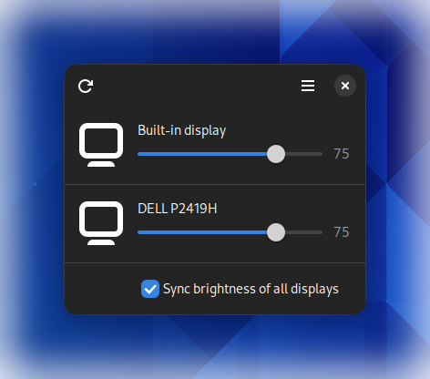

<a name="readme-top"></a>

<br />
<div align="center">
  <a href="https://github.com/sidevesh/com.sidevesh.Luminance">
    
  </a>

<h3 align="center">Luminance</h3>

  <p align="center">
    A simple GTK application to control brightness of displays including external displays supporting DDC/CI
    <br />
    <br />
  </p>
</div>

<div align="center">
  
</div>


## Setup

### Dependencies
- ddcutil library package (typically libddcutil or libddcutil-dev if not already installed with ddcutil)
- GTK 3.0

### Steps
1. Firstly, ensure that all the dependencies are installed:

    ##### Arch Linux:
    ```
    pacman -S --needed ddcutil gtk3
    ```
    
    ##### Ubuntu-based distros (credit @aidengilmartin):
    ```
    sudo apt install libgtk3-dev gcc
    sudo add-apt-repository ppa:rockowitz/ddcutil # add ddcutil repo
    sudo apt install ddcutil libddcutil-dev
    ```
    ##### Fedora:
    ```
    sudo dnf install ddcutil libddcutil libddcutil-devel gtk3-devel gcc
    ```

2. Ensure that your user has access to the i2c devices:
https://www.ddcutil.com/i2c_permissions/

3. Clone this repo along with its submodules:
    ```
    git clone --recurse-submodules https://github.com/sidevesh/Luminance.git
    ```

4. Change into the `Luminance` directory and execute build.sh to build this application:
    ```
    cd Luminance
    ./build.sh
    ```

5. This should result in a binary that you can execute to contol the brightness:
    ```
    ./build/app
    ```

6. To install this binary for all users execute 'install.sh' as root:
    ```
    sudo ./install_files/install.sh
    ```

    You should now be able to find Luminance in your list of apps


## Usage

Start the application normally or you can also use the app via cli interface:
```
Usage: com.sidevesh.Luminance [OPTIONS]
An application to control brightness of displays including external displays supporting DDC/CI

Options:
  -l, --list-displays              List displays and their brightness
  -g, --get-percentage [NUM]       Get the brightness percentage of a display
  -s, --set-brightness [NUM]       Set the brightness of a display to a percentage value
  -i, --increase-brightness [NUM]  Increase the brightness of a display by a percentage value
  -d, --decrease-brightness [NUM]  Decrease the brightness of a display by a percentage value
  -p  --percentage [PERCENT]       Percentage value to set the brightness to in case of --set-brightness option or to increase or decrease the brightness by in case of --increase-brightness or --decrease-brightness option
  -o, --show-osd                   Show OSD popup when brightness is changed for specified environment:
                                   g: GNOME, experimental, only works with https://extensions.gnome.org/extension/5952/eval-gjs/ extension installed
  -h, --help                       Show help information

When no arguments are provided, the application starts in GUI mode.
```


## License

Distributed under the GNU General Public License v3.0. See `LICENSE.txt` for more information.


## Contact

Swapnil Devesh - [@sid_devesh](https://twitter.com/sid_devesh) - me@sidevesh.com

Project Link: [https://github.com/sidevesh/com.sidevesh.Luminance](https://github.com/sidevesh/com.sidevesh.Luminance)


## Acknowledgments

- @ahshabbir : for ddcbc-api and ddcbc-gtk: https://github.com/ahshabbir/ddcbc-api
- @rockowitz : for ddcutil c api: https://github.com/rockowitz/ddcutil
